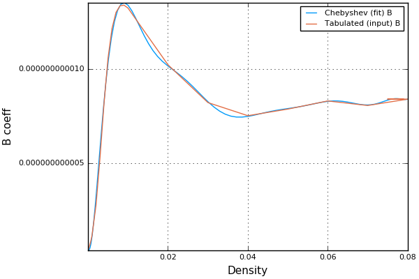

# B-coefficient-ApproxFun

This code uses the enjoyable https://github.com/ApproxFun/ApproxFun.jl package for Functional Approximation in Julia, to read in tabulated data, fit a polynomial and then do some maths + produce some figures.

The intent is to model photo-generated charge recombination (in particular, that
accessed by Time-Resolved-Photo-Luminescence) in the lead halide
perovskite (MAPI) solar cell material, making use of the density-dependent 'B'
coefficient we calculated in https://arxiv.org/abs/1604.04500 .

*"I've heard that if you say "Chebyshev" five times into a mirror, he'll turn up and fit you into a polynomial of best approximation."*

